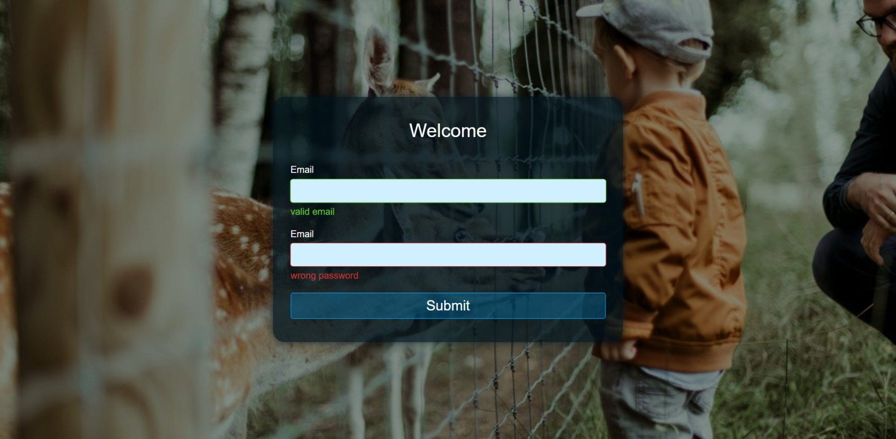

# Simple Login Screen

This is a simple login screen built using HTML and CSS. It provides static error and success states to give users feedback on their login attempts.

## Features

- Clean and minimalistic design.
- Static error and success states for login feedback.
- HTML form for user input.
- Styled with CSS.

## Preview



## Usage

1. Clone the repository:

   ```
   git clone https://github.com/Yussif20/loginScreen
   ```

2. Navigate to the project directory:

   ```
   cd LoginScreen
   ```

3. Open `index.html` in your preferred web browser.

4. Enter a username and password to test the login functionality.

## Structure

The project structure is as follows:

- `index.html`: Contains the HTML structure for the login form.
- `styles.css`: Contains the CSS styles for the login form.
- `preview.png`: Preview image of the login screen.

## Author

[Yousef Ayman](https://github.com/Yussif20)

Feel free to reach out if you have any questions or suggestions!
